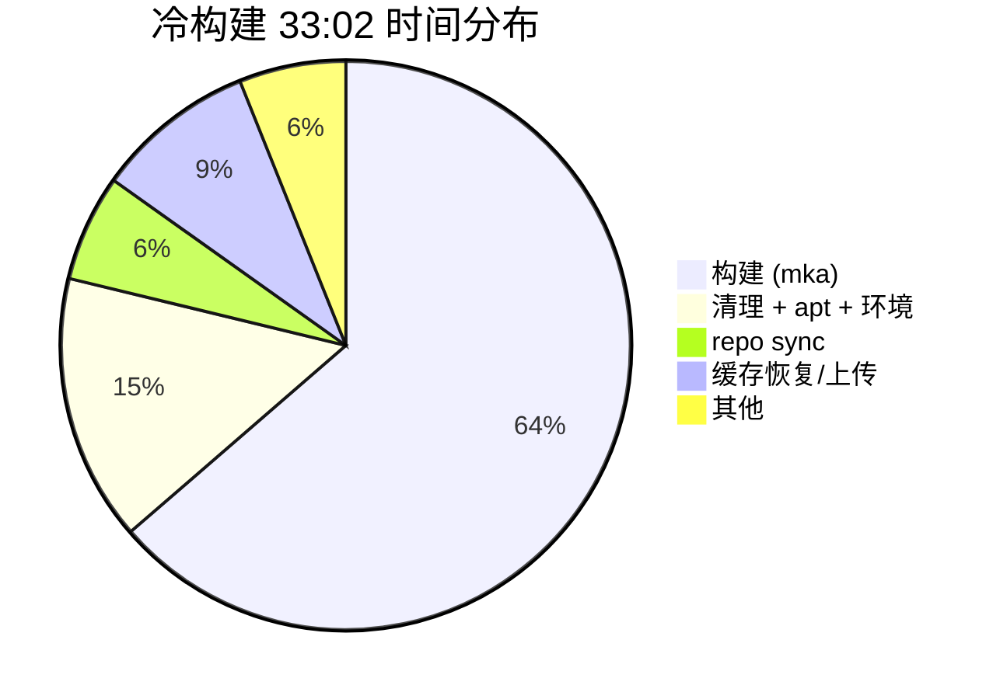
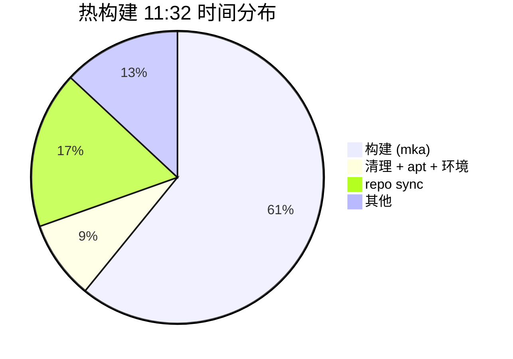
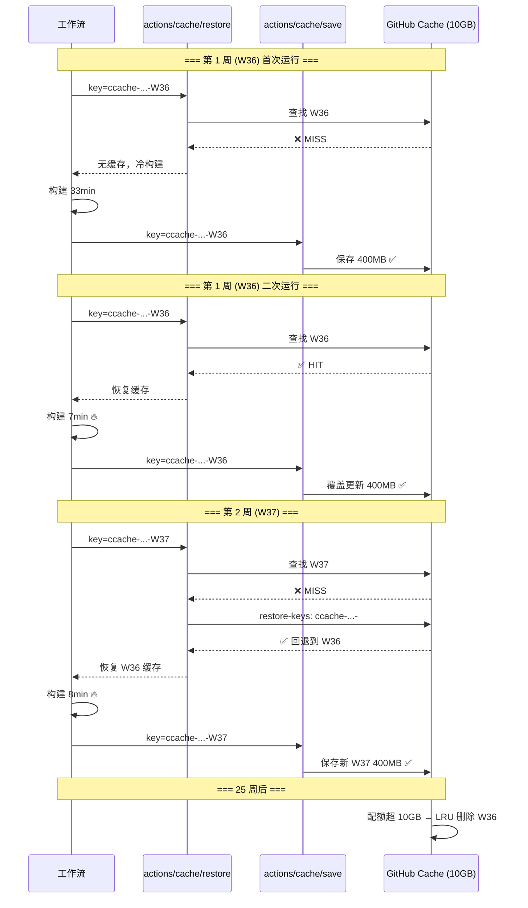

# build.yml Cache 优化计划

> 最后更新: 2026-09-03
> 状态: 计划阶段 (Plan Mode)

---

## 1. 构建流程分析 (ROI)

### 冷构建时间线 (Run 33737967865, 33:02)

| 步骤                            | 耗时       | 占比     | 可缓存?           | ROI        |
| ------------------------------- | ---------- | -------- | ----------------- | ---------- |
| 清理非必要软件包 (slimhub)      | ~3:47      | 11%      | ❌ 系统级          | —          |
| 安装 apt 依赖 (gperf, gcc, ...) | ~1:05      | 3%       | ❌ 系统级          | —          |
| 安装 OpenJDK 11                 | ~0:05      | <1%      | ✅ 内置缓存        | —          |
| 安装 repo 工具                  | ~0:00      | <1%      | ❌ 太小            | —          |
| **缓存 repo 恢复**              | ~2:12      | 7%       | ✅ 当前已缓存      | ⚠️ 8.0GB    |
| **同步 OrangeFox 源码**         | ~1:55      | 6%       | — repo cache 覆盖 | —          |
| 克隆设备树                      | ~0:04      | <1%      | ❌ 太小            | —          |
| **构建 (mka vendorbootimage)**  | **~33:14** | **~70%** | ✅ ccache          | **🔥 极高** |
| 上传到 Release                  | ~0:13      | <1%      | ❌                 | —          |

### 热构建时间线 (Run 33752923022, 11:32)

| 步骤                           | 耗时       | vs 冷构建           |
| ------------------------------ | ---------- | ------------------- |
| 缓存 repo 恢复                 | ~2:12      | 相同                |
| 同步 OrangeFox 源码            | ~2:22      | 略慢                |
| **构建 (mka vendorbootimage)** | **~11:40** | **节省 65% (21分)** |
| 总耗时                         | 11:32      | 节省 65%            |

### ROI 结论

| 缓存项         | 大小  | 节省时间      | 配额占比 | 是否值得       |
| -------------- | ----- | ------------- | -------- | -------------- |
| **ccache**     | 400MB | **~21分钟**   | 4%       | ✅ **必须保留** |
| **repo cache** | 8.0GB | ~2分钟 (间接) | 80%      | ⚠️ **高争议**   |

> **关键判断**: repo cache 8.0GB 占配额 80%，但只节省 repo sync 的 ~2 分钟（因为 repo sync 本身只需 ~2 分钟，且 repo cache 命中后仍需 sync 增量）。如果 repo cache 被驱逐，会连带 ccache 被挤出 → 下次冷构建 33 分钟。**repo cache 的 ROI 极低，建议移除。**

---

## 2. GitHub Actions Cache 配额

| 参数                   | 值                                                        |
| ---------------------- | --------------------------------------------------------- |
| 总配额                 | **10 GB** / 仓库                                          |
| 驱逐策略               | **LRU** (超过配额时)                                      |
| 未访问驱逐             | **7 天**未访问的缓存自动删除                              |
| actions/cache 最新版本 | **v6.1.0** (2025)                                         |
| v6 新特性              | `cache/restore` + `cache/save` 分离; `save-always` 已弃用 |
| `save-always` 状态     | **已弃用** — "does not work as intended, will be removed" |

---

## 3. 当前问题诊断

| #   | 问题                             | 证据                                                            | 严重度 |
| --- | -------------------------------- | --------------------------------------------------------------- | ------ |
| 1   | **两个 cache key 静态不变**      | 日志 `"Cache hit occurred on primary key ... not saving cache"` | 🔴 严重 |
| 2   | **repo cache 8.0GB 占 80% 配额** | 日志 `Sent 8604485238 of 8604485238`                            | 🔴 严重 |
| 3   | **所有缓存已被驱逐**             | `gh cache list` → `[]`                                          | 🟡 中等 |
| 4   | **ccache 失败时不保存**          | v6 `post-if: "success()"`                                       | 🟡 中等 |
| 5   | `save-always` 已弃用不可用       | v6 action.yml deprecationMessage                                | 🟡 中等 |

---

## 4. 工具/版本调查

### 4.1 是否有现成的成熟工具?

**结论: 没有专门的 Android ccache GitHub Action。**

- `actions/cache` 本身是官方通用缓存工具，已足够
- v6 的 `cache/restore` + `cache/save` 分离模式是官方推荐的最佳实践
- 不需要引入第三方缓存 action

### 4.2 当前版本 vs 最新版本

| Action                        | 当前版本 | 最新版本   | 需要升级? |
| ----------------------------- | -------- | ---------- | --------- |
| `actions/checkout`            | @v7      | v7.0.1     | ✅ 已最新  |
| `actions/setup-java`          | @v5      | **v6.0.0** | ⚠️ 可升级  |
| `actions/cache` (repo)        | @v4      | **v6.1.0** | ⚠️ 可升级  |
| `actions/cache` (ccache)      | @v6      | **v6.1.0** | ⚠️ 可升级  |
| `softprops/action-gh-release` | @v2      | **v3.0.3** | ⚠️ 可升级  |

### 4.3 工具链 (本项目管理)

本项目不涉及 pip/npm 等包管理器，主要工具链:

| 工具                    | 当前                  | 建议          |
| ----------------------- | --------------------- | ------------- |
| `repo`                  | curl 下载             | ✅ 合理        |
| `apt`                   | 直接 apt install      | ✅ 合理        |
| Java                    | actions/setup-java@v5 | → @v6         |
| `repack_vendor_boot.py` | Python 3 (系统)       | ✅ 仅用 stdlib |

---

## 5. 最终优化方案

### 阶段一: MVP (立即实施)

#### 修改 1: 移除 repo cache (节省 8GB 配额)

```yaml
# 删除这个步骤 (约 line 124-130)
- name: 缓存 repo
  uses: actions/cache@v4
  with:
    path: workspace/.repo
    key: repo-fox-...
```

原因: 8GB/10GB 配额，ROI 极低（仅节省 ~2分钟），且挤占 ccache 空间。

#### 修改 2: ccache 改为 cache/restore + cache/save 分离模式

```yaml
# === 新增: 准备缓存键 (在初始化工作目录后) ===
- name: 准备缓存键
  id: cache-key
  run: |
    mkdir -p ~/.ccache
    echo "week=$(date +%Y-W%V)" >> $GITHUB_OUTPUT

# === 替换: 原来的 "设置 ccache" ===
- name: 恢复 ccache
  id: ccache-restore
  uses: actions/cache/restore@v6
  with:
    path: ~/.ccache
    key: ccache-fox-${{ github.event.inputs.DEVICE_NAME }}-${{ github.event.inputs.FOX_BRANCH }}-${{ steps.cache-key.outputs.week }}
    restore-keys: |
      ccache-fox-${{ github.event.inputs.DEVICE_NAME }}-${{ github.event.inputs.FOX_BRANCH }}-

# === 新增: 在构建步骤后、上传前 ===
- name: 保存 ccache
  if: always()
  uses: actions/cache/save@v6
  with:
    path: ~/.ccache
    key: ${{ steps.ccache-restore.outputs.cache-primary-key }}
```

#### 修改 3: 升级 action 版本

```yaml
actions/cache@v4   → actions/cache@v6.1.0  (或保留 @v6)
actions/setup-java@v5 → actions/setup-java@v6
softprops/action-gh-release@v2 → softprops/action-gh-release@v3
```

### 阶段二: 观察 (修改后)

1. 运行 2-3 次构建，观察:
   - `gh cache list` 确认 ccache 存在且持续更新
   - 构建时间稳定在 7-9 分钟
   - 缓存不被驱逐

2. 如果 repo sync 变慢（从 2 分钟变长）:
   - 考虑缓存 `.repo/project-objects` 而非整个 `.repo`

### 阶段三: 可选优化

- 降低 `ccache -M 10G` → `5G` (实际只用 400MB)
- 添加 `repo sync -c --no-tags` 减少网络传输

---

## 6. 验证方式

```bash
# 修改后验证步骤
gh run watch                    # 实时查看运行
gh cache list --limit 5         # 确认缓存存在
gh run view <run_id> --log | grep -E "Cache (saved|hit|miss)"  # 确认行为
```

### 预期结果

| 指标           | 修改前        | 修改后                   |
| -------------- | ------------- | ------------------------ |
| 缓存配额使用   | 8.4GB (84%)   | ~400MB (4%)              |
| 冷构建时间     | 33 分钟       | ~33 分钟 (无 repo cache) |
| 热构建时间     | 7-9 分钟      | 7-9 分钟                 |
| 缓存更新       | 永不更新      | 每周更新                 |
| 缓存驱逐风险   | 高 (84% 配额) | 低 (4% 配额)             |
| 构建失败时缓存 | 不保存        | 保存 (if: always())      |

---

## 7. CI 流程图

```mermaid
flowchart TD
    A([👤 workflow_dispatch 手动触发]) --> B[📋 显示运行参数]
    B --> C[🧹 清理非必要软件包<br/>slimhub_actions]
    C --> D[📥 检出代码<br/>actions/checkout@v7]
    D --> E[📦 安装 apt 依赖<br/>gperf gcc ccache ...]
    E --> F[☕ 安装 OpenJDK 11<br/>actions/setup-java@v6]
    F --> G{🔑 SSH 密钥?}
    G -->|是| H[🔐 设置 SSH 密钥<br/>webfactory/ssh-agent]
    G -->|否| I[📥 安装 repo 工具]
    H --> I
    I --> J[📂 初始化工作目录<br/>mkdir workspace]
    J --> K[🔧 准备缓存键<br/>week=YYYY-W##]
    K --> L[🔄 同步 OrangeFox 源码<br/>repo sync]
    L --> M[🌳 克隆设备树]
    M --> N{📁 通用树?}
    N -->|有| O[🌳 克隆通用树]
    N -->|无| P[📦 同步设备依赖]
    O --> P
    P --> Q[💾 设置交换空间<br/>12GB swap]
    Q --> R[♻️ 恢复 ccache<br/>actions/cache/restore@v6]

    R --> S{🐛 SSH 调试?}
    S -->|是| T[🔌 开启 tmate SSH]
    S -->|否| U[🏗️ 构建]
    T --> U

    U --> V[🔨 mka vendorbootimage<br/>ccache -M 10G]

    V --> W{构建结果?}
    W -->|✅ 成功| X[💾 保存 ccache<br/>actions/cache/save@v6]
    W -->|❌ 失败| X

    X --> Y[📤 上传到 Release<br/>action-gh-release@v3]
    Y --> Z([✅ 完成])

    style A fill:#4CAF50,color:#fff
    style Z fill:#4CAF50,color:#fff
    style V fill:#FF9800,color:#fff
    style R fill:#2196F3,color:#fff
    style X fill:#2196F3,color:#fff
    style U fill:#FF9800,color:#fff
    style W fill:#f44336,color:#fff
```



### 耗时拆解 (冷构建 ~33min)



### 耗时拆解 (热构建 ~11min, ccache命中)



### 缓存生命周期



## 8. 深度分析：优化点 & 工具链（基于冷构建实测数据）

> 数据来源: [run 33782799774](https://github.com/cjy0812/T50-OrangeFox/actions/runs/33782799774) 冷构建 ~42min

### 8.1 逐步骤实测耗时

```
冷构建 42min 分解:
  Set up job        4s      ▏
  显示运行参数        0s      
  清理非必要软件包    4m 30s  ████████          ← 🚨 隐藏瓶颈 #3 (10.7%)
  检出代码           2s      
  准备环境 (apt)     1m 17s  ██                ← 用户质疑
  安装 OpenJDK       5s      
  SSH 密钥          0s      
  安装 repo          1s      
  初始化工作目录      0s      
  准备缓存键          0s      
  同步 OrangeFox 源码 5m 37s  ██████████        ← 用户质疑 #2 (13.4%)
  克隆设备树          4s      
  通用树 / 依赖 / swap 3s      
  恢复 ccache        2s      
  SSH 调试           0s      
  ───────────────────────────
  构建 recovery      30m 18s ████████████████████████████████████████████████  ← 72%
  ───────────────────────────
  保存 ccache        5s      
  上传 Release       10s     
```

### 8.2 用户质疑的 ROI 重新分析

#### Q1: 准备环境 (apt) 缓存 — 1m 17s 值得缓存吗？

| 项目         | 值                  |
| ------------ | ------------------- |
| 冷构建耗时   | 1m 17s              |
| 可缓存部分   | 下载 .deb 包 (~30s) |
| 不可缓存部分 | 解包 + 配置 (~47s)  |
| 缓存大小     | ~500MB              |
| 节省         | ~30s/次             |
| 配额占比     | 5% (500MB/10GB)     |

✅ **值得。** 500MB 配额轻量，每次冷构建省 30s，key 用 `hashFiles('build.yml')` 自动失效。

#### Q2: 同步 OrangeFox 源码 (repo sync) 缓存 — 5m 37s 值得缓存吗？

| 项目         | 值                            |
| ------------ | ----------------------------- |
| 冷构建耗时   | 5m 37s                        |
| 可缓存部分   | git objects 下载 (~3min)      |
| 不可缓存部分 | checkout + 脚本逻辑 (~2.5min) |
| 缓存大小     | **~8GB**                      |
| 节省         | ~3min/次                      |
| 配额占比     | **80% (8GB/10GB)**            |

❌ **不值得。** 8GB 占 80% 配额，只省 3min。源码更新后 cache 立即过期。替代方向：`--depth=1` 浅克隆。

### 8.3 🚨 新发现：slimhub 是隐藏瓶颈！

`清理非必要软件包` 占 **4m 30s (10.7%)**，之前完全忽略！

```
slimhub 做了什么 (4m 30s):
  apt-get remove android-sdk         → 释放 ~5GB
  apt-get remove dotnet-sdk          → 释放 ~2GB  
  apt-get remove haskell-stack       → 释放 ~3GB
  apt-get remove ...                 → 各种大型包
  apt-get autoremove                 → 清理依赖
  docker rmi                         → 清理 Docker 镜像
  rm -rf /usr/share/dotnet           → 清理 .NET
  rm -rf /usr/local/lib/android      → 清理 Android SDK
```

**slimhub 不可缓存**（清理的是系统包），但可以优化：

| 方案                          |  节省  | 风险                       |
| ----------------------------- | :----: | -------------------------- |
| A. 跳过 slimhub               | 4m 30s | 磁盘空间不足，构建可能失败 |
| B. 精简清理（只删最大的几个） | ~3min  | 磁盘略紧张                 |
| C. 保持现状                   |   0    | 无                         |

> **建议：方案 B** — 用自定义脚本替代 slimhub，只删除 Android SDK + .NET + Docker 镜像，跳过其他小包清理。预计 4m 30s → ~1min。

### 8.4 修订后的优化优先级

```
🥇 P0: slimhub 精简    4m 30s → 1min     省 3m 30s  (零缓存成本)
🥈 P1: apt 缓存         1m 17s → 47s      省 30s      (500MB 缓存)
🥉 P2: repo --depth=1   5m 37s → ~3min    省 2m 30s   (需脚本支持)
```

### 8.5 工具链对比

| 工具     | 当前                 | 替代方案     | 结论                        |
| -------- | -------------------- | ------------ | --------------------------- |
| 编译缓存 | **ccache**           | sccache      | 单机 CI 无优势。**保持**    |
| 链接器   | GNU **ld**           | mold         | AOSP 不直接支持。**不适用** |
| 磁盘清理 | **slimhub**          | 自定义脚本   | **建议替换**                |
| 包管理器 | **apt**              | —            | 加 apt cache。**已规划**    |
| 构建系统 | **mka**              | —            | AOSP 标准。**不可替换**     |
| 源码同步 | **repo**             | —            | AOSP 标准。**不可替换**     |
| 运行器   | **ubuntu-latest**    | ubuntu-24.04 | 显式 pin 版本               |
| 缓存     | **actions/cache@v6** | —            | 官方最佳                    |

### 8.6 总预期收益

| 场景   | 当前   | 优化后 | 节省           |
| ------ | ------ | ------ | -------------- |
| 冷构建 | ~42min | ~35min | **7min (17%)** |
| 热构建 | ~11min | ~9min  | 2min           |

## 9. 回滚方案

如果出现问题，回滚到当前 build.yml:

```bash
git checkout HEAD -- .github/workflows/build.yml
```